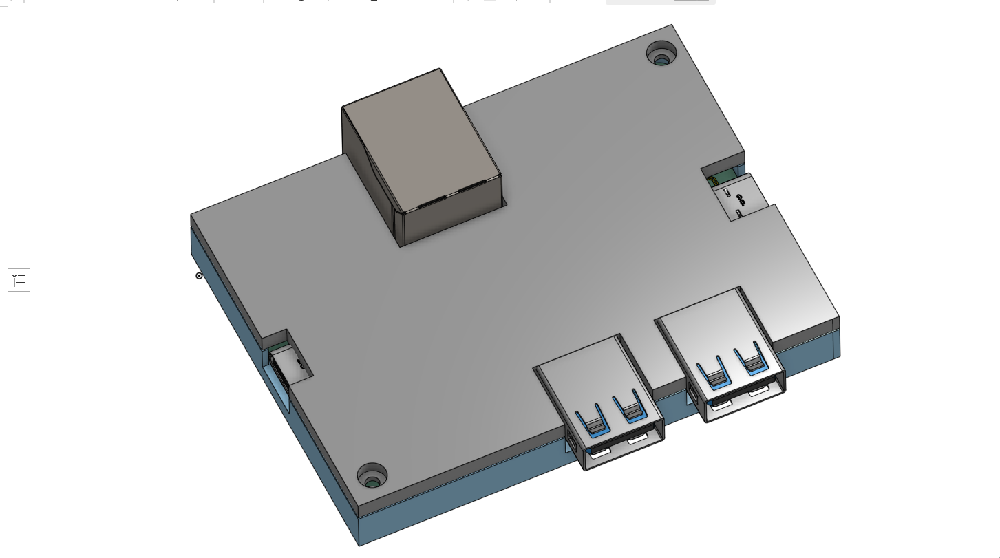
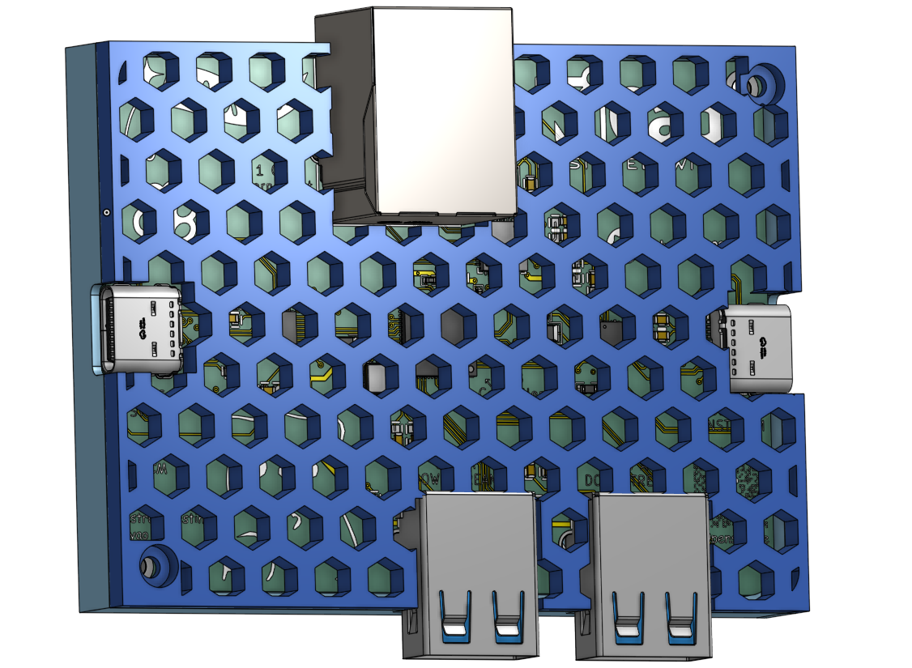

# Very cool usb hub!!
its a 4 port\* usb 3.0 gen1 hub with usb c as a upstream port. It is fully open source and you can built it yourself!!! \
\*1 of its port is for 1gb ethernet

# Key Features
- Built in **1 Gigabit Ethernet** port using [REALTEK RTL8153B](https://www.lcsc.com/product-detail/C2802072.html)
- **2 USB A** and **1 USB C** 3.0 gen 1 downstream port
- **USB C upstream** so you can use **C to C** and **C to USB** cable!!!(with any length you want)
- Very cool art :3

# Why did i make it?
 currently theres literally no usb hub that does usb c 3.0 as upstream without having its cord built in, its bad and if the cord break u either throw it out or destroy the case to repair it.

# How to use it?
 💀 its an usb hub dude, just plug the usb c upstream to a pc and plug peripheral into the usb c and a port 😭

# 3D image 
- With case: (pss, check it out on [onshape](https://cad.onshape.com/documents/b8187d4a30cc3b22176f8391/w/6bf875d6f0e4efab8544a163/e/2b79dfe3cdb89a71b66a7f8a?renderMode=0&uiState=6a1873326ab1afd1b1dcb9ab))

case 2!!

-Without case

# SCHEMATIC
 check out the schematic [here](schematic.pdf) if the image is too blurry

 
 
# PCB
 This is a 4 layer pcb made using [Kicad](https://www.kicad.org/), design with attention(😭) to signal intergrity for USB 3 trace! check it out with [kicanvas](https://kicanvas.org/?repo=https%3A%2F%2Fgithub.com%2Fduykhanh09103%2FCoolUsbHub%2Ftree%2Fmain%2Fpcb)!!
 - **Layer 1: signal**

  
 - **Layer 2: Ground**

  
 - **Layer 3: Ground**

  
 - **Layer 4: Signal/Vbus**
 
  

# BOM (Bill Of Materials)
> [!IMPORTANT]
> This is the total of the bom including both thing below, do not double count by combining them
> You can leave thing that you already have out of the bom to reduce cost

| Name                    | Amount | Price | Source/Where To Buy | Note                                                     |
|-------------------------|--------|-------|---------------------|----------------------------------------------------------|
| PCB                     | 5      | $12   | JLCPCB              | 4 layer, specify 3313 in stackup(i got white so its 12$) |
| 3D Printed Case         | 2      | $2.74 |                     |                                                          |
| PCB Parts               | 2      | $30.86| LCSC                |                                                          |
| Tools and miscellaneous | 1      | $22   |                     |                                                          |
| Shipping                |        | $11   |                     |                                                          |
| Coupon from fallout     |        | -$15  |                     |                                                          |
|                         |        |       |                     |                                                          |
| Total                   |        | $63.6 |                     |                                                          |

## PCB Parts
> [!IMPORTANT]
> This will include how much components you need to use per 1 PCB and the MOQ (minimum of quanity) you can buy. The price will be listed in MOQ. The final price is included everything except shipping.
> [!WARNING]
>  There might be different capacitor/resistor part from production bom because of out of stock

|            Name           | Amount | MOQ |  Price  |         Note         | LCSC Number |
|---------------------------|--------|-----|---------|----------------------|-------------|
| 39pf 50v 0603 Capacitor   | 4      | 100 | $0.48   |                      | C107049     |
| 10uF 10v 0603 Capacitor   | 1      | 20  | $0.53   |                      | C19702      |
| RTL8153B-VB-CG            | 1      | 1   | $3.64   | Ethernet chip (1gb)  | C2802072    |
| 20kΩ 62.5mW 0402 Resistor | 3      | 100 | $0.10   |                      | C93942      |
| 4.7kΩ 63mW 0402 Resistor  | 1      | 100 | $0.44   |                      | C509343     |
| RJ45 Jack                 | 1      | 1   | $2.51   |                      | C54408      |
| HD3SS3220RNHR             | 2      | 1   | $1.9032 | USB TYPE C MUX       | C165155     |
| Type C Receptacle         | 2      | 5   | $1.60   | on sale              | C20883027   |
| GL3510-OSY52              | 1      | 1   | $1.46   | USB HUB              | C7501408    |
| Type A Receptacle         | 2      | 5   | $0.66   |                      | C2845330    |
| 25MHz 20pf crystal        | 2      | 10  | $0.98   |                      | C13740      |
| 900kΩ 250mW 1206 Resistor | 1      | 10  | $0.63   |                      | C871726     |
| 10kΩ 62.5mW 0402 Resistor | 2      | 100 | $0.27   |                      | C2906861    |
| 1kΩ 62.5mW 0402 Resistor  | 1      | 50  | $0.89   |                      | C852624     |
| 200kΩ 100mW 0603 Resistor | 2      | 100 | $0.22   | on sale              | C2907009    |
| 100nF 50V 0603 Capacitor  | 31     | 50  | $0.92   |                      | C282518     |
| 2.49k X   0402 Resistor   | 1      | 100 | 15k VND | I got it from shopee | X           |
|                           |        |     |         |                      |             |
| Total                     |        |     | $19.44  |                      |             |

## Tool and miscellaneous
> [!NOTE]
> If you have the tool already or wanna do this differently, you do not need to buy these

|        Name       | Amount |  Price |          Source          |
|-------------------|--------|--------|--------------------------|
| Hot air gun       | 1      | $21    | Lazada                   |
| Flux              | 1      | $1     | Shopee                   |
| Pinecil           | 1      | $25.99 | Pinecil official website |
| Solder paste/wire | 1      | $1     | Idk its everywhere       |

# How to build??? (soon 👀)

# Credit
 Shoutout to [@tobycm](https://github.com/tobycm) for being the goat and help me a lot with ts project <3\
 This project use kicad, onshape for designing case and pcb\
 Thanks to [Hackclub](https://hackclub.com/) , especially to people running [Fallout](https://fallout.hackclub.com/) for making this project possible :3

# LICENSE
its [MIT](https://opensource.org/license/mit)!! (basically u can do anything with ts). checkout [LICENSE](LICENSE)
 
