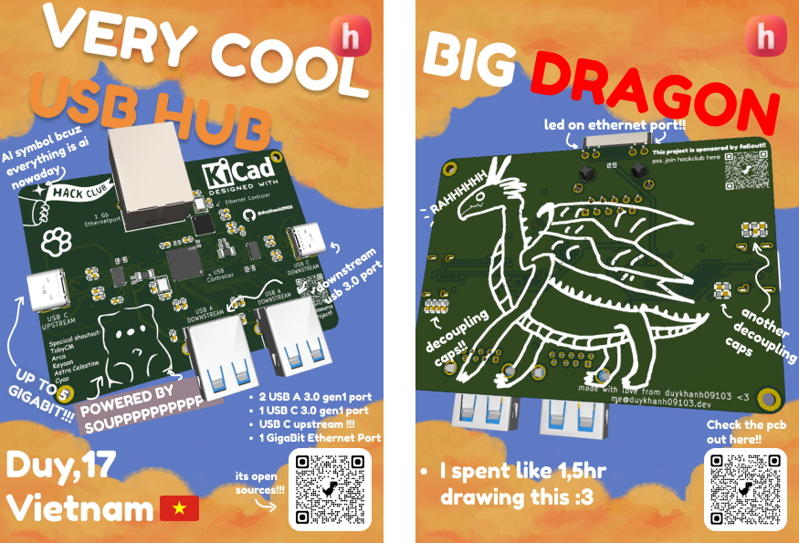
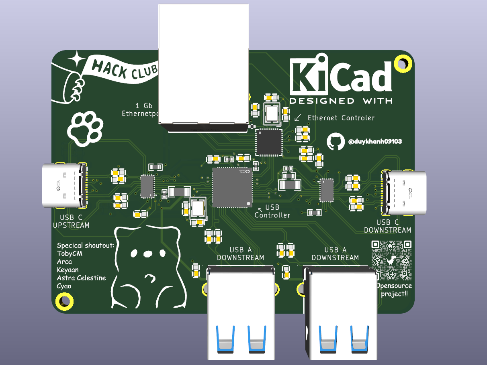
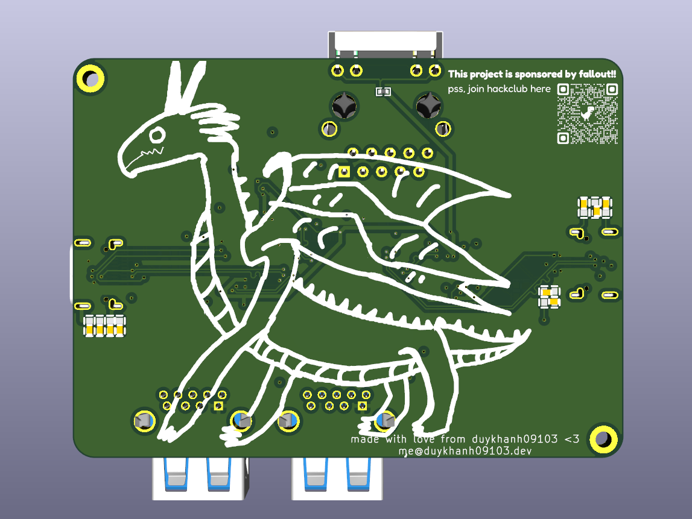
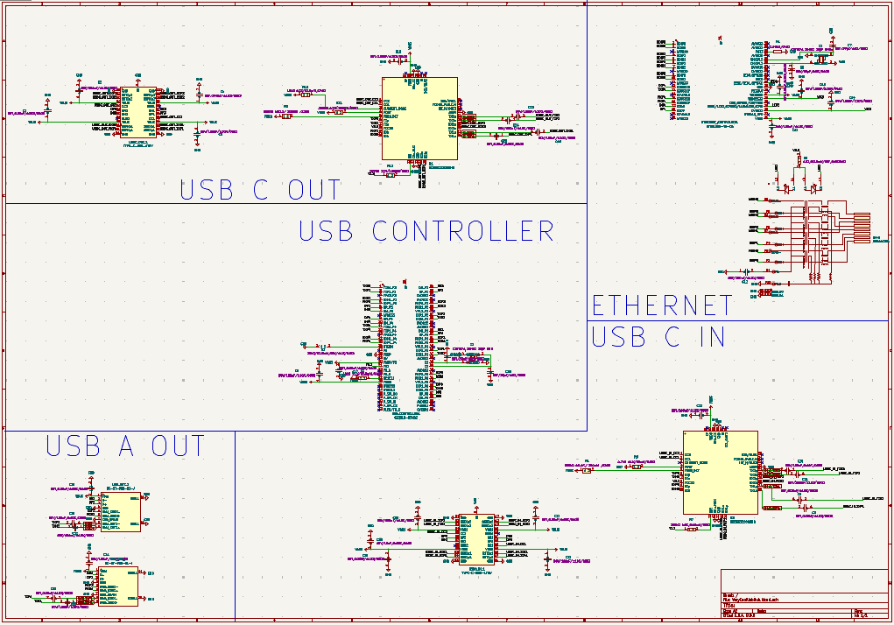
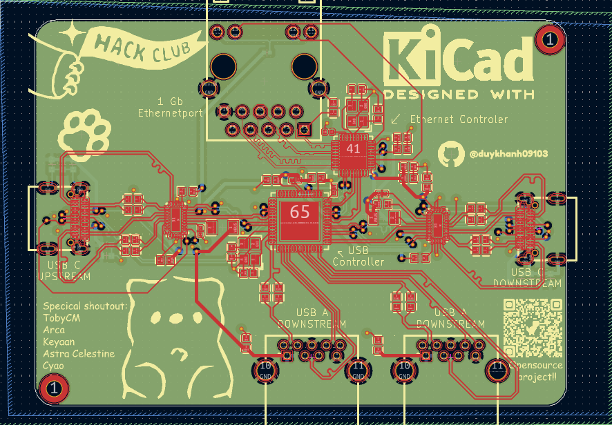
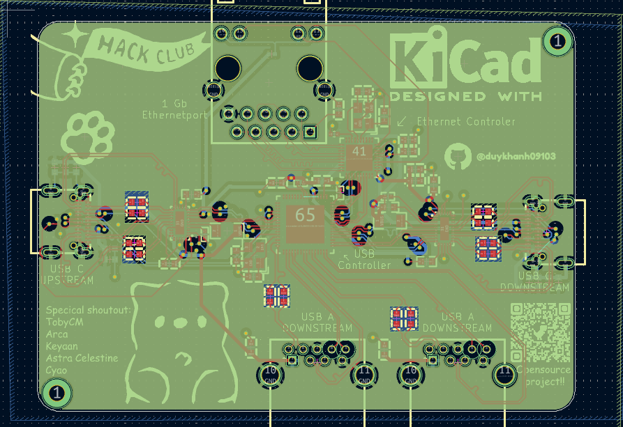
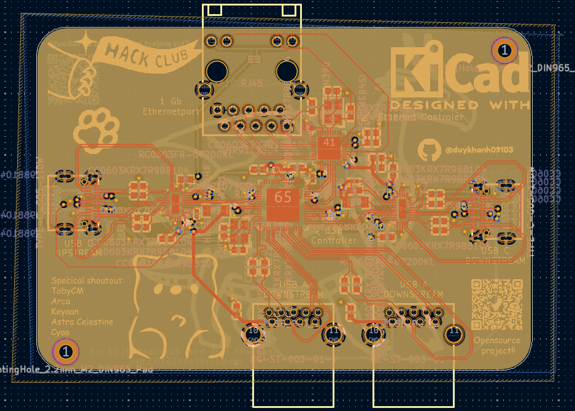
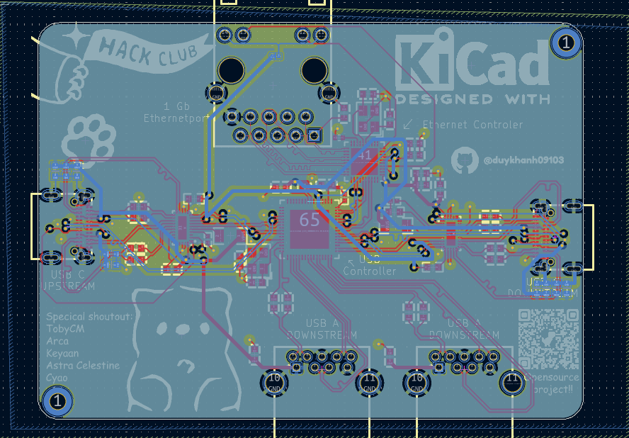

# Very cool usb hub!!
its a 4 port\* usb 3.0 gen1 hub with usb c as a upstream port. It is fully open source and you can built it yourself!!! \
\*1 of its port is for 1gb ethernet

# Key Features
- Built in **1 Gigabit Ethernet** port using [REALTEK RTL8153B](https://www.lcsc.com/product-detail/C2802072.html)
- **2 USB A** and **1 USB C** 3.0 gen 1 downstream port
- **USB C upstream** so you can use **C to C** and **C to USB** cable!!!(with any length you want)
- Very cool art :3

# Why did i make it?
 currently theres literally no usb hub that does usb c 3.0 as upstream without having its cord built in, its bad and if the cord break u either throw it out or destroy the case to repair it.

# How to use it?
 💀 its an usb hub dude, just plug the usb c upstream to a pc and plug peripheral into the usb c and a port 😭

# 3D image of the PCB

# SCHEMATIC
 check out the schematic [here](schematic.pdf) if the image is too blurry

 
 
# PCB
 This is a 4 layer pcb made using [Kicad](https://www.kicad.org/), design with attention(😭) to signal intergrity for USB 3 trace! check it out with [kicanvas](https://kicanvas.org/?repo=https%3A%2F%2Fgithub.com%2Fduykhanh09103%2FCoolUsbHub%2Ftree%2Fmain%2Fpcb)!!
 - **Layer 1: signal**

  
 - **Layer 2: Ground**

  
 - **Layer 3: Ground**

  
 - **Layer 4: Signal/Vbus**
 
  

# BOM (Bill Of Materials)

| Part               | Amount | Price                          | Link                                                                                                                                                                                               |
|--------------------|--------|--------------------------------|----------------------------------------------------------------------------------------------------------------------------------------------------------------------------------------------------|
| PCB                | 5      | $7                             | jlcpcb.com/                                                                                                                                                                                        |
| 100nF Capacitor    | 31     | $0.35                          | https://www.lcsc.com/product-detail/C14663.html                                                                                                                                                    |
| 39 pF Capacitor    | 4      | $0.32                          | https://www.lcsc.com/product-detail/C107049.html                                                                                                                                                   |
| 10 uF Capacitor    | 1      | $0.25                          | https://www.lcsc.com/product-detail/C19702.html                                                                                                                                                    |
| Ethernet Adapter   | 1      | $4.26                          | https://www.lcsc.com/product-detail/C2802072.html                                                                                                                                                  |
| 10k ohm resistor   | 2      | $0.09                          | https://www.lcsc.com/product-detail/C60490.html                                                                                                                                                    |
| 200k ohm resistor  | 2      | $0.16                          | https://www.lcsc.com/product-detail/C105574.html                                                                                                                                                   |
| 20k ohm resistor   | 3      | $0.10                          | https://www.lcsc.com/product-detail/C93942.html                                                                                                                                                    |
| 1k ohm resistor    | 1      | $0.09                          | https://www.lcsc.com/product-detail/C106235.html                                                                                                                                                   |
| 4.7 k ohm resistor | 1      | $0.34                          | https://www.lcsc.com/product-detail/C509343.html                                                                                                                                                   |
| 2.49k ohm resistor | 1      | $0.57                          | https://shopee.vn/Tr%E1%BB%9F-d%C3%A1n-0402-tr%E1%BB%8B-s%E1%BB%91-trong-2K-(-2K-2.2K-2.26K-2.32K-2.49K-2.55K-2.61K-2.67K-2.7K-2.74K-2.8K-2.87K-)-d%C3%B9ng-cho-th%E1%BB%A3-i.72014335.17404856692 |
| RJ45 connector     | 1      | $2.51                          | https://www.lcsc.com/product-detail/C54408.html                                                                                                                                                    |
| USB C mux          | 2      | $3.89                          | https://www.lcsc.com/product-detail/C165155.html                                                                                                                                                   |
| USB C receptacle   | 2      | $1.48                          | https://www.lcsc.com/product-detail/C20883027.html                                                                                                                                                 |
| USB Controller     | 1      | $1.46                          | https://www.lcsc.com/product-detail/C7501408.html                                                                                                                                                  |
| 25mhz Crystal      | 2      | $0.75                          | https://www.lcsc.com/product-detail/C13740.html                                                                                                                                                    |
| 900k ohm resistor  | 1      | $0.45                          | https://www.lcsc.com/product-detail/C871726.html                                                                                                                                                   |
| USB A receptacle   | 2      | $0.65                          | https://www.lcsc.com/product-detail/C2845330.html                                                                                                                                                  |
| Total              |        | 24.11$ (shipping not included) |                                                                                                                                                                                                    |

# Credit
 Shoutout to [@tobycm](https://github.com/tobycm) for being the goat and help me a lot with ts project <3\
 This project use kicad, onboard for designing case and pcb\
 Thanks to [Hackclub](https://hackclub.com/) , especially to people running [Fallout](https://fallout.hackclub.com/) for making this project possible :3

# LICENSE
its [MIT](https://opensource.org/license/mit)!! (basically u can do anything with ts). checkout [LICENSE](LICENSE)
 
